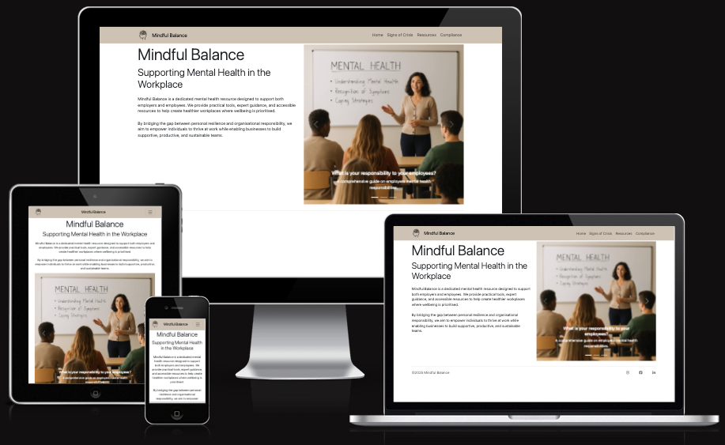

# Flagstone Project #1 'Mindful Balance'

- - -

## What is it?

Mindful Balance is a website with the dual purpose of providing mental health support to the general public and guidance to employers both based in the United Kingdom. 

The site contains information on the warning signs of a mental health crisis, a section on where to seek help and a section that outlines an employers responsibilities.

- - -

## UX

The website was designed to be clear, simplistic and calming. Information is provided clearly, concisely and in the order at which it is best actioned. 

The navigation bar is fixed to the top of the page in order to make nagivation as simple as possible and for redundancy, the Logo, website name and home button will all take the user back to the index page. 

All external links open to a new tab in order to avoid the user not returning after looking at external resources. 

- - -

## Color scheme

Colours were chosen to be both neutral yet calming for anyone that may visit the site whilst having a mental health crisis.

Colours palette chosen was:
- Deep Teal: rgba(26, 83, 92, 1)
- Soft Sage: rgba(173, 192, 178, 1)
- Mist: rgba(243, 247, 244, 1)
- Warm Taupe: rgba(214, 201, 187, 1)
- Ink: rgba(38, 50, 56, 1)

- - -

## Typography

Google Fonts and Font Awesome libraries were used.

The ***"Quicksand"*** Google font was used for all text elements on the site at a weight of 400.

Font Awesome was used for icons used in the footer and elsewhere.

Favicon from Google Font “Cognition”

Logo made by Upon Graphic from flaticon.com
<a href="https://www.flaticon.com/free-icons/mental-health" title="mental health icons">Mental health icons created by Upnow Graphic - Flaticon</a>

- - -

## Tools and Technology
* HTML used for the main site content.
* CSS used for the main site design and layout.
* Bootstrap 5 used for an enhanced responsive layout.
* GitHub used for secure online code storage.
* Git used for version control. (git add, git commit, git push)
* GitHub Pages used for hosting the deployed front-end site.
* Google Fonts used for fonts on the site.
* ChatGPT used to generate color palettes and research mental health information
  * ADD MORE, W3C, JIGSAW validators, Co-pilot validation

ChatGPT also assisted by generating the code for the "Immediate assistance" div in the Resources page. 

Testing performed with Lighthouse:

- - -

## Deployment

When deploying this project, the repository was first created on GitHub and then cloned locally using VS Code. The project files, including an index.html, were added and changes were committed and pushed back to the remote repository. Deployment was enabled through the GitHub Pages settings, which serves the site directly from the repository branch. Once activated, any further commits that are pushed will automatically update and redeploy the live site without additional setup.

The link to the deployment is: https://followrob.github.io/Flagstone_Project_1/