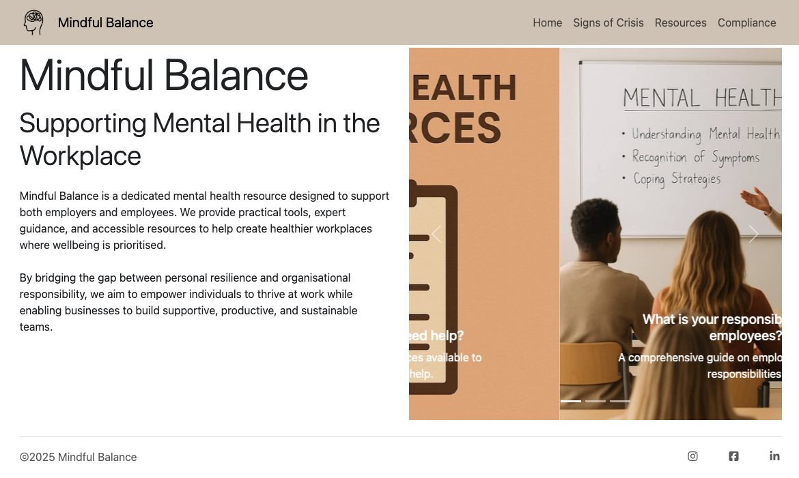

# Flagstone Project #1 'Mindful Balance'

# What is it?

Mindful Balance is a website with the dual purpose of providing mental health support to the general public and guidance to employers both based in the United Kingdom. 

The site contains information on the warning signs of a mental health crisis, a section on where to seek help and a section that outlines an employers responsibilities.

- - -

# UX

The website was designed to be clear, simplistic and calming. Information is provided clearly, concisely and in the order at which it is best actioned. 

The navigation bar is fixed to the top of the page in order to make nagivation as simple as possible and for redundancy, the Logo, website name and home button will all take the user back to the index page. 

All external links open to a new tab in order to avoid the user not returning after looking at external resources. 

## Navigation

The page navigation is designed to be followed in a linear fashion like a workflow:

Home -> Are you in crisis? -> What to do about it if you are? -> Advice for employers regarding mental health

## Homepage

The Index page was designed as a hub for users to view what is available on the Mindful Balance website and make the decision whether it contains the resources they need and whether to continue with the site or not.

## Signs of Crisis

Signs of Crisis is the next step in the journey of the user, it provides an explaination of the importance of spotting the signs of struggle early and provides a list of common signs that can be observed either in others around them or in themselves.

## Resources

The next step of the journey is the Resources page, this prompted the user to call 999 if someone is in a crisis and in immediate danger. The page contains two cards, one providind reasuring information for the reader if they are the one in need as well as next steps to follow. The second card contains information for the users who are observing that someone other than them is having a crisis as well as next steps. 

The section below contains a list of resources that individuals in the UK can access to seek help. 

## Compliance

The final page provides a header that reminds both employers and employees that employers have the legal and ethical responsibility to care for their employees wellbeing. The section below contains the key passages and titles of laws employers must follow to be in compliance with mental health and safety at their place of work. 

- - -

## Color scheme

Colours were chosen to be both neutral yet calming for anyone that may visit the site whilst having a mental health crisis.

Colours palette chosen was:
- Deep Teal: rgba(26, 83, 92, 1)
- Soft Sage: rgba(173, 192, 178, 1)
- Mist: rgba(243, 247, 244, 1)
- Warm Taupe: rgba(214, 201, 187, 1)
- Ink: rgba(38, 50, 56, 1)

- - -

## Typography

Google Fonts and Font Awesome libraries were used.

The ***"Quicksand"*** Google font was used for all text elements on the site at a weight of 400.

Font Awesome was used for icons used in the footer and elsewhere.

Favicon from Google Font “Cognition”

Logo made by Upon Graphic from flaticon.com
<a href="https://www.flaticon.com/free-icons/mental-health" title="mental health icons">Mental health icons created by Upnow Graphic - Flaticon</a>

- - -

# Tools and Technology
* HTML used for the main site content.
* CSS used for the main site design and layout.
* Bootstrap 5 used for an enhanced responsive layout.
* GitHub used for secure online code storage.
* Git used for version control. (git add, git commit, git push)
* GitHub Pages used for hosting the deployed front-end site.
* Google Fonts used for fonts on the site.
* ChatGPT used to generate color palettes and research mental health information
* Validation was performed by Co-pilot, W3 HTML validator and JIGSAW CSS validator
* Some beautification was performed using the Prettier VSCode extension

Testing performed with Lighthouse:

- - -

# The Use of AI

ChatGPT was utilised to generate the code for the "Immediate assistance" div in the Resources page, for the contributing content within the site itself and as a sounding board for some small errors that were made along the way.

Co-pilot was utilisied for making small edits to elements such as class tags and clearing up excess / symbols generated by Bootstrap, it was also used for code validation. 

AI certainly had a place in this project as all information was sourced with ChatGPT including the recommended colours within the colour palette (I'm a little colour blind so not to be trusted when it comes to style).

- - -

# Deployment

When deploying this project, the repository was first created on GitHub and then cloned locally using VS Code. The project files, including an index.html, were added and changes were committed and pushed back to the remote repository. Deployment was enabled through the GitHub Pages settings, which serves the site directly from the repository branch. Once activated, any further commits that are pushed will automatically update and redeploy the live site without additional setup.

The link to the deployment is: https://followrob.github.io/Flagstone_Project_1/
